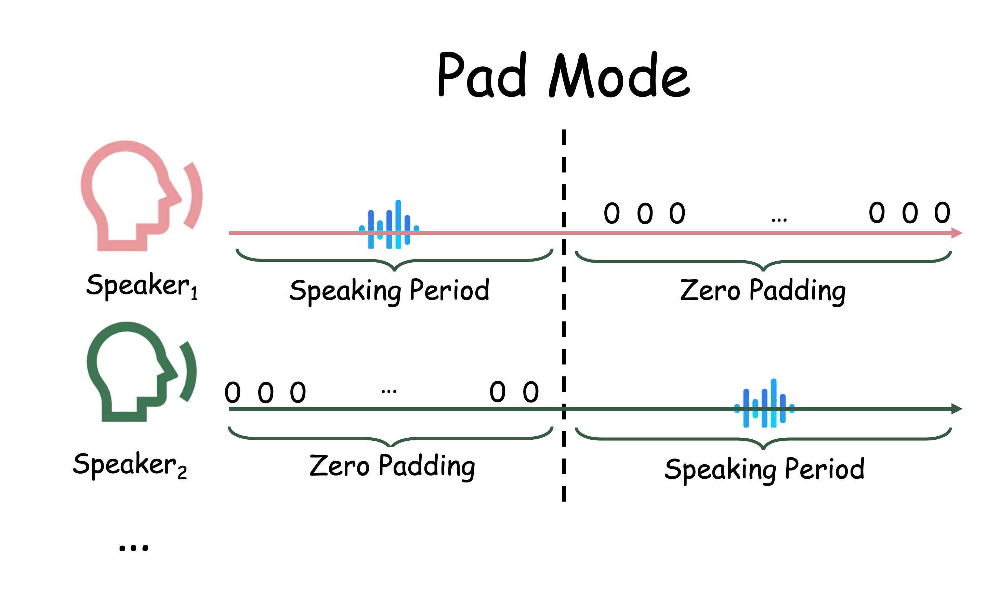

<div align="center">


<h1>AnyTalker: Scaling Multi-Person Talking Video Generation with Interactivity Refinement</h1>

[Zhizhou Zhong](https://scholar.google.com/citations?user=t88nyvsAAAAJ ) · [Yicheng Ji](https://kongzhecn.github.io) · [Zhe Kong](https://kongzhecn.github.io) · [Yiying Liu*](https://openreview.net/profile?id=~YiYing_Liu1) ·  [Jiarui Wang](https://scholar.google.com/citations?user=g7I2bJ8AAAAJ) · [Jiasun Feng](https://scholar.google.com/citations?hl=zh-CN&user=MGHcudEAAAAJ) ·  [Lupeng Liu](https://openreview.net/profile?id=~Lupeng_Liu2)  · [Xiangyi Wang](https://openreview.net/profile?id=~Xiangyi_Wang6 )  · [Yanjia Li](https://openreview.net/profile?id=~Yanjia_Li1)  · [Yuqing She](https://openreview.net/profile?id=~Yuqing_She1)  · [Ying Qin](https://scholar.google.com/citations?user=6KwG7hYAAAAJ) · [Huan Li](https://scholar.google.com/citations?user=fZoYJz8AAAAJ ) · [Shuiyang Mao](https://scholar.google.com/citations?user=YZSd5fsAAAAJ) · [Wei Liu](https://scholar.google.com/citations?user=AjxoEpIAAAAJ) · [Wenhan Luo](https://whluo.github.io/)<sup>&#9993;</sup>

<sup>*</sup>Project Leader
<sup>&#9993;</sup>Corresponding Author


<a href='https://hkust-c4g.github.io/AnyTalker-homepage/'></a>
<a href='https://arxiv.org/abs/2511.23475/'></a>
<a href='https://huggingface.co/zzz66/AnyTalker-1.3B/tree/main'></a>
</div>

> **TL; DR:**  AnyTalker is an audio-driven framework for generating multi-person talking videos. It features a flexible multi-stream structure to scale identities while ensuring seamless inter-identity interactions. 

<p align="center">
  
</p>

## Video Demos (Generated with the 1.3B model; 14B results [here](https://hkust-c4g.github.io/AnyTalker-homepage/))

<table>
  <thead>
    <tr>
      <th>Input Image</th>
      <th>Generated Video</th>
    </tr>
  </thead>
  <tbody>
    <tr>
      <td></td>
      <td><video src="https://github.com/user-attachments/assets/41ed669d-57ed-48dc-9a54-97b2a12dce45" style="width:100%; aspect-ratio:16/9; object-fit:cover;" controls loop></video></td>
    </tr>
    <tr>
      <td></td>
      <td><video src="https://github.com/user-attachments/assets/f01afb3f-efeb-4df5-b6bb-1f74cc4f3941" style="width:100%; aspect-ratio:16/9; object-fit:cover;" controls loop></video></td>
    </tr>
    <tr>
      <td></td>
      <td><video src="https://github.com/user-attachments/assets/ffa3de10-ca6f-4b5f-bb84-8b53646a4751" style="width:100%; aspect-ratio:16/9; object-fit:cover;" controls loop></video></td>
    </tr>
  </tbody>
</table>

## 🔥 Latest News
🔥 *Nov 28, 2025:* We release the **AnyTalker** [weights](#), [inference code](#), and [project page](https://hkust-c4g.github.io/AnyTalker-homepage).

📖 *Dec 1, 2025:* We release the [technical report](https://arxiv.org/abs/2511.23475).

## 📑 Todo List
- [x] Inference code
- [x] 1.3B stage 1 checkpoint (trained exclusively on single-person data)
- [x] Benchmark for evaluate Interactivity 
- [x] Technical report 
- [ ] 14B model (coming soon to the [Video Rebirth](https://www.videorebirth.com/)'s creation platform)

## Quick Start

### 🛠️Installation

#### 1. Create a conda environment and install pytorch
```
conda create -n AnyTalker python=3.10
conda activate AnyTalker 
pip install torch==2.6.0 torchvision==0.21.0 torchaudio==2.6.0 --index-url https://download.pytorch.org/whl/cu126
```
#### 2. Other dependencies
```
pip install -r requirements.txt
```
#### 3. Flash-attn installation:
```
pip install ninja 
pip install flash_attn==2.8.1 --no-build-isolation
```
#### 4. FFmpeg installation

You need an FFmpeg build with x264 (libx264) support to encode H.264 videos.
Depending on your environment, you can install it via one of the following commands:

```sh
# Ubuntu / Debian
apt-get install ffmpeg
```
or
```sh
# CentOS / RHEL
yum install ffmpeg ffmpeg-devel
```
or
```sh
# Conda (no root required) 
conda install -c conda-forge ffmpeg
```

> ⚠️ **Note:**
> If you install FFmpeg via conda and encounter the error `Unknown encoder 'libx264'`, or if the following command does **not** list libx264:
> 
> ```bash
> ffmpeg -encoders | grep libx264
> ```
> you can install a specific conda-forge build that includes libx264 support:
> 
> ```bash
> conda install -c conda-forge ffmpeg=7.1.0
> ```
> 
> Reference: [bytedance/LatentSync#60](https://github.com/bytedance/LatentSync/issues/60)


### 🧱Model Preparation

| Models        |                       Download Link                                           |    Notes                      |
| --------------|-------------------------------------------------------------------------------|-------------------------------|
| Wan2.1-Fun-V1.1-1.3B-InP  |      🤗 [Huggingface](https://huggingface.co/alibaba-pai/Wan2.1-Fun-V1.1-1.3B-InP)       | Base model
| wav2vec2-base |      🤗 [Huggingface](https://huggingface.co/facebook/wav2vec2-base-960h)          | Audio encoder
| AnyTalker-1.3B      |      🤗 [Huggingface](https://huggingface.co/zzz66/AnyTalker-1.3B)              | Our weights

Download models using huggingface-cli:
``` sh
# curl -LsSf https://hf.co/cli/install.sh | bash
hf download alibaba-pai/Wan2.1-Fun-V1.1-1.3B-InP --local-dir ./checkpoints/Wan2.1-Fun-1.3B-Inp
hf download facebook/wav2vec2-base-960h --local-dir ./checkpoints/wav2vec2-base-960h
hf download zzz66/AnyTalker-1.3B --local-dir ./checkpoints/AnyTalker
```
The directory shoube be organized as follows.

```
checkpoints/
├── Wan2.1-Fun-V1.1-1.3B-InP
├── wav2vec2-base-960h
└── AnyTalker
``` 


### 🔑 Quick Inference
The provided script currently performs 480p inference on a single GPU and automatically switches between single-person and multi-person generation modes according to the length of the [input audio list](./input_example/customize_your_input_here.json).


```sh
#!/bin/bash
export CUDA_VISIBLE_DEVICES=0
python generate_a2v_batch_multiID.py \
		--ckpt_dir="./checkpoints/Wan2.1-Fun-1.3B-Inp" \
		--task="a2v-1.3B" \
		--size="832*480" \
		--batch_gen_json="./input_example/customize_your_input_here.json" \
		--batch_output="./outputs" \
		--post_trained_checkpoint_path="./checkpoints/AnyTalker/1_3B-single-v1.pth" \
		--sample_fps=24 \
		--sample_guide_scale=4.5 \
		--offload_model=True \
		--base_seed=44 \
		--dit_config="./checkpoints/AnyTalker/config_af2v_1_3B.json" \
		--det_thresh=0.15 \
		--mode="pad" \
		--use_half=True 
```
or 
```bash
sh infer_a2v_1_3B_batch.sh
```

#### Descriptions on some hyper-parameters
```
--offload_model: Whether to offload the model to CPU after each model forward, reducing GPU memory usage.
--det_thresh: detection threshold for the InsightFace model; a lower value improves performance on abstract-style images.
--sample_guide_scale: recommended value is 4.5; applied to both text and audio.
--mode: select "pad" if every audio input track has already been zero-padded to a common length; select "concat" if you instead want the script to chain each speaker’s clips together and then zero-pad the non-speaker segments to reach a uniform length.
--use_half: Whether to enable half-precision (FP16) inference for faster acceleration.
```

<p align="center">
  <br>
  Illustration of “pad” mode for audio inputs.
</p> 

## Benchmark
We provide the benchmark used in our paper to evaluate *Interactivity*, including the dataset and the metric computation script.
### Download the Dataset from YoTube
#### 1. Install yt-dlp
```sh
python -m pip install -U yt-dlp
```
#### 2. Run the downlaod script
```sh
cd ./benchmark
python download.py
```
The directory shoube be organized as follows.

```
benchmark/
├── audio_left            # Audio for left speaker (zero-padded to full length)
├── audio_right           # Audio for right speaker (zero-padded to full length)
├── speaker_duration.json # Start/end timestamps for each speaker
├── interact_11.mp4       # Example video 
└── frames                # Reference image supplied as the first video frame
``` 
#### *Interactivity* evaluation
```sh
# single video
python calculate_interactivity.py --video interact_11.mp4

# entire directory
python calculate_interactivity.py --dir ./your_dir
```
The script prints the *Interactivity* score defined in the paper.
**Note**: generated videos must keep the exact same names listed in `speaker_duration.json`.


## 📚 Citation

If you find our work useful in your research, please consider citing:

```
@misc{zhong2025anytalkerscalingmultipersontalking,
      title={AnyTalker: Scaling Multi-Person Talking Video Generation with Interactivity Refinement}, 
      author={Zhizhou Zhong and Yicheng Ji and Zhe Kong and Yiying Liu and Jiarui Wang and Jiasun Feng and Lupeng Liu and Xiangyi Wang and Yanjia Li and Yuqing She and Ying Qin and Huan Li and Shuiyang Mao and Wei Liu and Wenhan Luo},
      year={2025},
      eprint={2511.23475},
      archivePrefix={arXiv},
      primaryClass={cs.CV},
      url={https://arxiv.org/abs/2511.23475}, 
}
```

## 📜 License
The models in this repository are licensed under the Apache 2.0 License. We claim no rights over the your generated contents, 
granting you the freedom to use them while ensuring that your usage complies with the provisions of this license. 
You are fully accountable for your use of the models, which must not involve sharing any content that violates applicable laws, 
causes harm to individuals or groups, disseminates personal information intended for harm, spreads misinformation, or targets vulnerable populations. 
